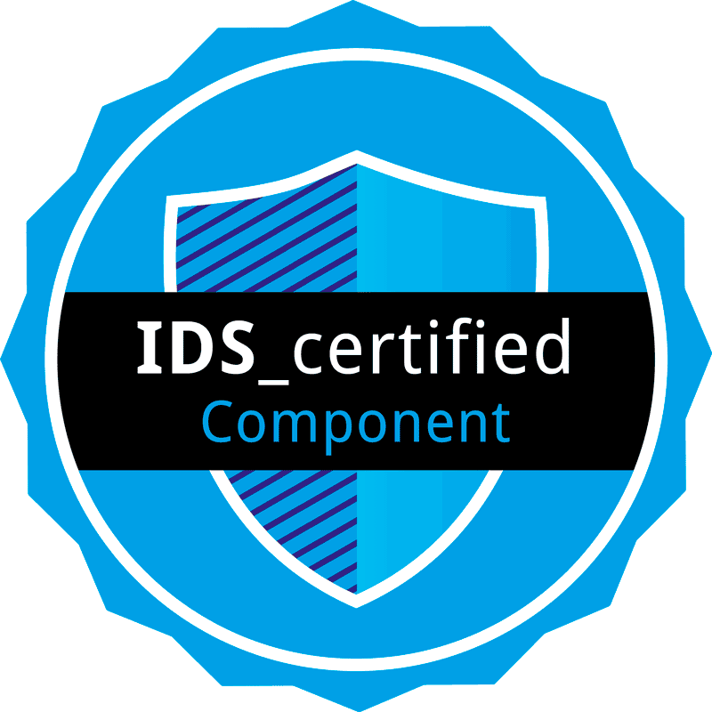

# Energy Data Space Connector FIWARE Data App

## Introduction



This project started from and extends the [Engineering True Connector](https://github.com/Engineering-Research-and-Development/true-connector), a general purpose Data Space Connector and open-source project developed by ENG. The connector is an open-source solution, designed to enable self-determined data sharing while ensuring compliance with regulations such as GDPR. Initially focused on the manufacturing domain, the TRUE Connector has proven its versatility across diverse sectors including circular economy, energy, smart buildings, and agri-food domains. It has recently received IDS certification.


## First Step - Configuration
Clone the Data-Space-Fiware-True-Connector environment on your server.

The change for customization must be made in the three files, some configuration files must be modified:

**/src/test/resources/application.properties**

**/src/main/resources/application.properties**

**/docker/.env**


In this case it is necessary to change the IP address (e.g., 217.172.12.150) by entering the IP of the server hosting this new installation.


/src/test/resources/application.properties-application.orion.host=**your-ip-address**

/src/test/resources/application.properties-application.mongo.host=**your-ip-address**

/src/main/resources/application.properties-application.orion.host=**your-ip-address**

/src/main/resources/application.properties-application.mongo.host=**your-ip-address**

/docker/.env-LOCAL_IP_PROVIDER_CONTEXT_BROKER=**your-ip-address**


## Second Step - Build & Start
Let's start the Data Space Connector services, first step compile the java code and create the build.

cd data-space-connector-fiware-data-app/

### JAVA Build 

mvn clean install -U -e

### Docker build

docker build -t data-space-connector-fiware-data-app:1.0 .

cd docker

### Start orion-context-broker service

docker-compose -f docker-compose-cb.yml up -d

cd doc

### Start Data-Space-Fiware-true-connector

docker-compose up -d

## API Examples

### Create Entity
```
curl --location --request POST 'http://<LOCAL IP ADDRESS>:8084/createentity' `
--header 'Content-Type: application/ld+json' `
--data-raw '{
    "id": "urn:ngsi-ld:Building:store001",
    "type": "Building",
    "category": {
        "type": "Property",
        "value": ["commercial"]
    },
    "address": {
        "type": "Property",
        "value": {
            "streetAddress": "Via Emanuele Gianturco 15",
            "addressRegion": "Campania",
            "addressLocality": "Napoli",
            "postalCode": "80142"
        },
        "verified": {
            "type": "Property",
            "value": true
        }
    },
    "location": {
        "type": "GeoProperty",
        "value": {
             "type": "Point",
             "coordinates": [14.286190426655033, 40.845961239858234]
        }
    },
    "name": {
        "type": "Property",
        "value": "Engineering Ingegneria Informatica"
    },
    "@context": [
        "https://fiware.github.io/data-models/context.jsonld",
        "https://uri.etsi.org/ngsi-ld/v1/ngsi-ld-core-context-v1.3.jsonld"
    ]
}'
```

### Registration

```
curl --location --request POST 'http://<LOCAL IP ADDRESS>:8084/registration' `
--header 'Content-Type: application/ld+json' `
--data-raw '{
    "entityId": "urn:ngsi-ld:Building:store001",
    "eccUrl": "http://<PROVIDER IP ADDRESS>:8889/data",
    "brokerUrl": "http://<PROVIDER IP ADDRESS>:1026"
}'
```

### Get Entity

```
curl --location --request GET 'http://<LOCAL IP ADDRESS>:8084/getentity/urn:ngsi-ld:Building:store001' `
--header 'host;' `
--header 'accept: application/json'
```

[](https://opensource.org/licenses/AGPL-3.0)
[](https://hub.docker.com/r/interstore/data-space-connector-fiware-data-app)
